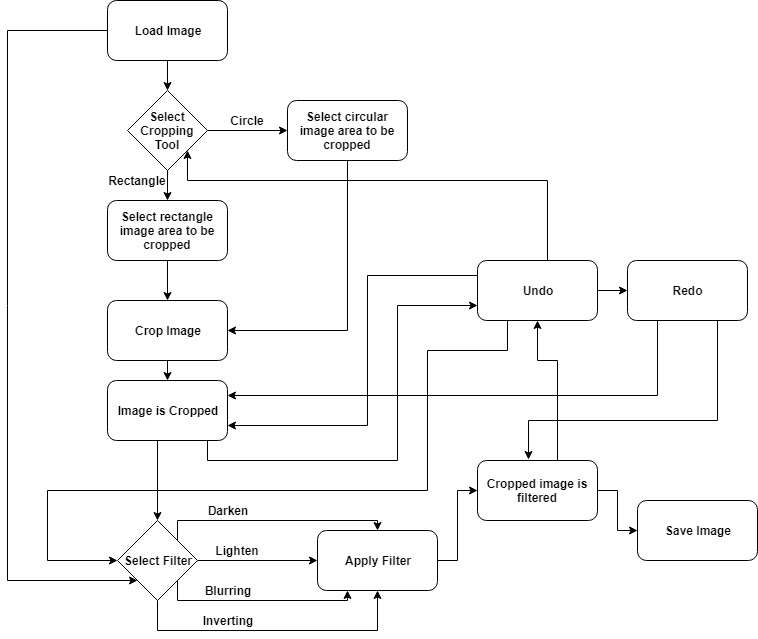
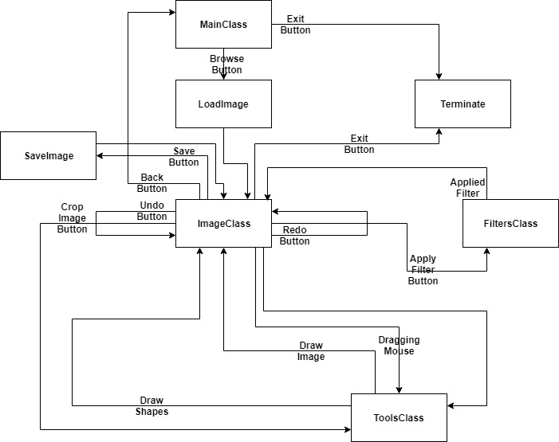
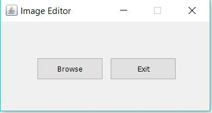
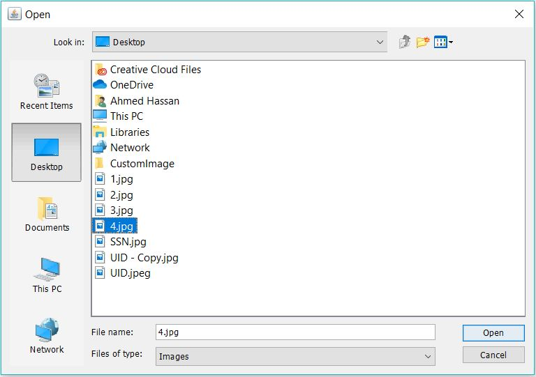
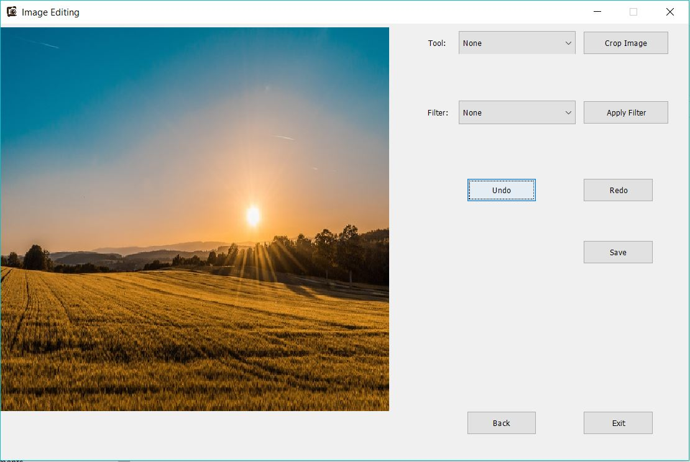
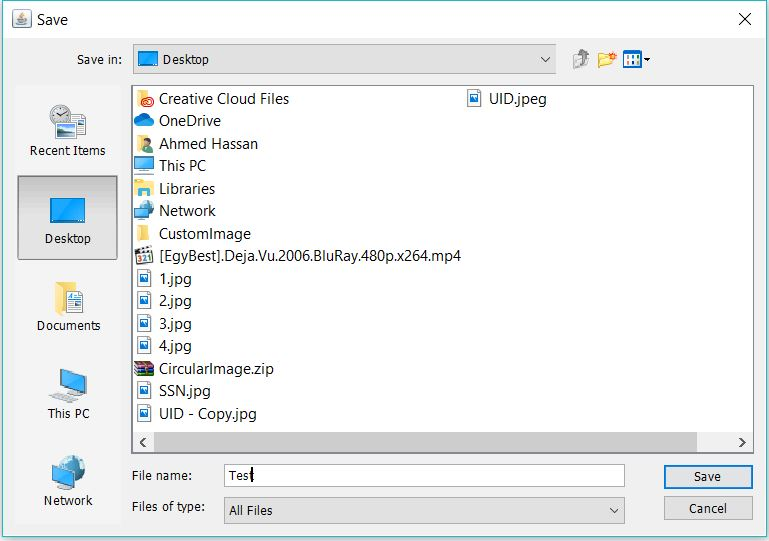
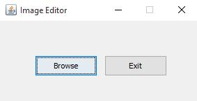

# **Image Editing**

#### Project By: 
**Ahmed Mohamed Hassan** (Junior Software Developer)

[LinkedIn Profile](https://www.linkedin.com/in/ahmed-mohamed-128142105/ "LinkedIn Profile")

[Wuzzuf Profile](https://wuzzuf.net/me/Ahmed-Mohammed-34 "Wuzzuf Profile")

## Introduction
Image manipulation programs like Photoshop include various filters or transformations that are applied to images to produce different effects. In this report we are discussing a project that can apply four different transformations on a loaded image:
- Lighten Images
- Darken Images
- Blur Images
- Invert Images

## System Architecture and Design

## Structure of the code

#### Modules Names:
- MainClass
- ImageClass
- ToolsClass
- FiltersClass

Once program runs, MainClass is fired and in this point we have only 2 options:

- Browse
- Exit

 If Exit then program terminates; if Browse then an open window appears to select the required image from computer then ImageClass is fired after selecting the image to reconstruct the second frame and call ToolsClass to draw the image.
 
**Now, we have 7 options:**
- Exit
- Back
- Save
- Undo
- Redo
- Apply Filter
- Crop Image

If Exit then program terminates, if Back then MainClass will be fired to select another image, if Save then a save window appears to save the image after editing, Undo is to reset the current editing of the image, Redo is to reset what Undo have been done, Apply Filter fires FiltersClass to apply the filter that have been chosen from the Filter Combo Box to the image then ToolsClass is fired again to redraw the image with the filter, Crop Image fires ToolsClass to crop the image after firing ToolClass to draw the shape that have been chosen from the Tool Combo Box with the coordinates specified by a mouse drag then ToolsClass if fired again to redraw the cropped image.

## User Interface

## Project Features

#### Load image

#### Crop (Circle/Rectangle)

#### Image Filter
##### Light

##### Dark

##### Blur

##### Invert

## How to run

Just run **ImageEditor/ImageEditor.exe**
